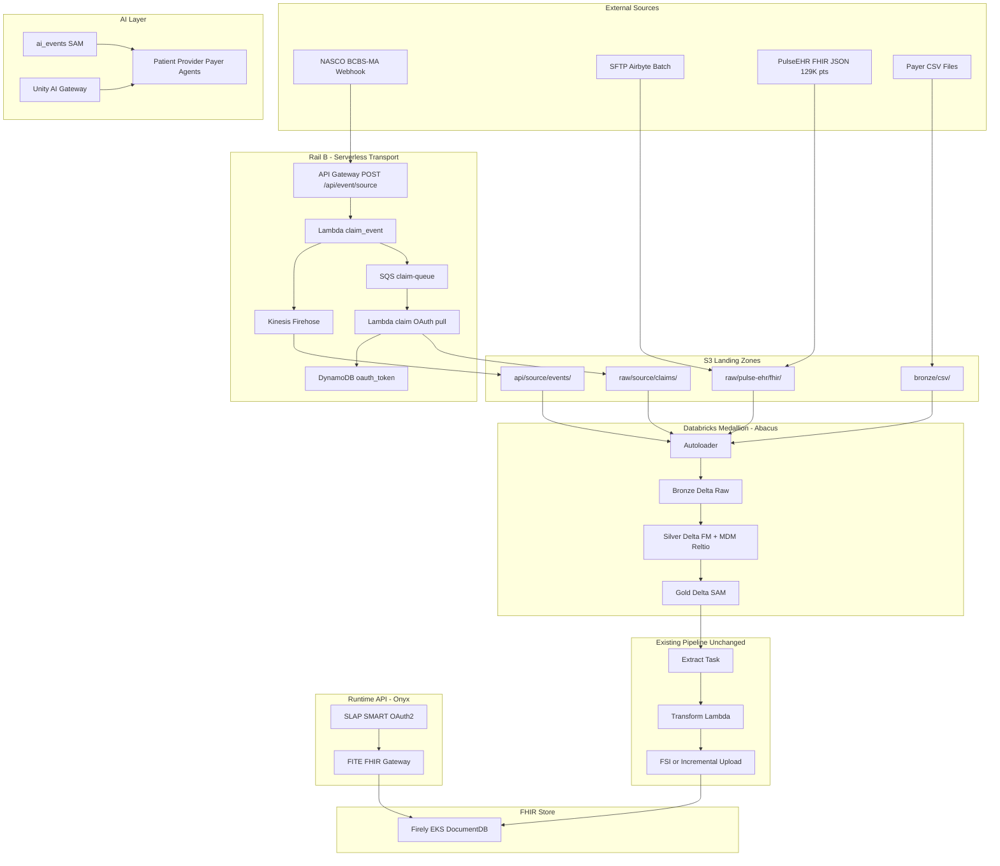
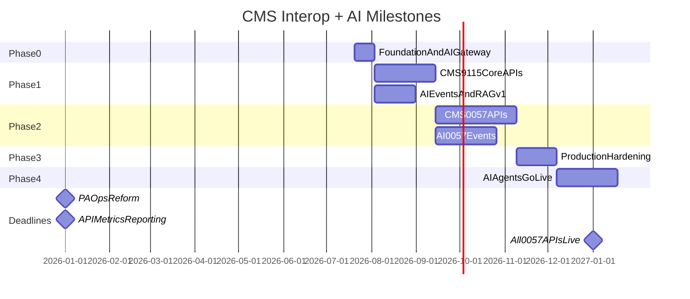

# Healthcare Interop Solution — Production Implementation Plan (v3 — Multi-Channel Ingestion + AI)

## Context

The [Training/](Training/) folder contains **12 onboarding sessions** (Feb 4–17, 2026): recordings, transcripts, and AI summaries covering environment setup, E2E workflows, Firely/HealthLake, data loads, FSI, and security. It does **not** contain runnable code.

The **implementation blueprint** lives in the parent repo:


| Resource                                                                                             | Purpose                                        |
| ---------------------------------------------------------------------------------------------------- | ---------------------------------------------- |
| [README.md](../README.md)                                                                            | Architecture overview, quick-start, API matrix |
| [implementation_details.md](../implementation_details.md)                                            | 6-component system deep dive                   |
| [interop_onyx_project_plan.md](../interop_onyx_project_plan.md)                                      | 7-module engineering curriculum                |
| [cms_9115_vs_0057_implementation_map.md](../cms_9115_vs_0057_implementation_map.md)                  | CMS rule → component mapping                   |
| [sam-firely-e2e-aws-implementation-map.html](../sam-firely-e2e-aws-implementation-map.html)          | 12-step AWS production pipeline                |
| 10 operational artifacts (Databricks handbook, Seiji runbook, security/performance checklists, etc.) | Run/operate production                         |


Local Python servers ([interop_pipeline.py](../interop_pipeline.py), [fhir_server.py](../fhir_server.py), [slap_server.py](../slap_server.py), [p2p_member_match.py](../p2p_member_match.py)) are **reference simulations** — use them to validate FHIR shapes and API flows before wiring production services.

Production code lives in separate repos referenced in training: `onyx-infrastructure`, `onyx-helmsman`, `ng-onyx-runtime`, `firely-fsi-image`, `mdp-gateway`, Kitchen Sous Chef, `**ng-nasco-event-api**` (serverless transport).

Reference EHR export: [PulseEHR FHIR Summary Report](/Users/ashishsingh/PulseEHR/fhir_ehr_summary_report.pdf) — 129,218 patients, ~8.9M FHIR R4 JSON resources (Observation, Encounter, Immunization, Procedure, Condition, MedicationRequest, DiagnosticReport, CarePlan, Patient, AllergyIntolerance).

---

## Proficiency Guarantee (v3.1)

This plan is realigned so that **completing all phases guarantees working proficiency** in seven roles — not slide-deck familiarity:


| Role                              | Guaranteed By Phases | Measurable Exit                                      |
| --------------------------------- | -------------------- | ---------------------------------------------------- |
| FHIR Engineer                     | 0–2                  | IG-valid bundles; CMS-9115 + 0057 APIs live          |
| Data Engineer                     | 0–1, 4               | 3 ingestion rails; SAM convergence; ai_events mart   |
| Kafka Engineer                    | 0–1 (Rail B)         | MSK/SQS transport; schema contracts; DLQ/replay      |
| AI Engineer                       | 1, 4                 | RAG + agents + Unity AI Gateway in prod              |
| Forward Deployed Engineer         | 0, 3                 | Solo dev deploy; customer runbooks; incident restore |
| Intermediate Associate Programmer | 0–3                  | pytest green; independent transformer patches        |
| Associate Solution Architect      | 0–3                  | CMS traceability matrix; hybrid ADRs; phase gates    |


Each of the **445 interview Q&A entries** in [Healthcare_Interop_Interview_Cheat_Sheet.md](/Users/ashishsingh/Interview/Healthcare_Interop_Interview_Cheat_Sheet.md) now includes a **Script** segment — runnable bash/Python/SQL tied to the question. Run every Script as you complete the corresponding phase.

---

## What's New in v3 — Multi-Channel Ingestion (Existing Solution Intact)

**Design principle:** The original CSV → FM → SAM → FHIR → Firely → SLAP/FITE path is **unchanged**. v3 adds **parallel ingestion rails** that land data in the same S3 Bronze buckets and converge at the **SAM layer** before Extract → Firely. No existing workflow family is replaced.

### Three ingestion rails


| Rail                                    | Pattern                        | Source examples                      | Landing zone                                      | Joins existing pipeline at                                             |
| --------------------------------------- | ------------------------------ | ------------------------------------ | ------------------------------------------------- | ---------------------------------------------------------------------- |
| **Rail A — CSV/Batch (existing)**       | Synthea CSV, payer flat files  | Claims, Clinical CSVs                | S3 Bronze via Glue/direct upload                  | FM → SAM (unchanged)                                                   |
| **Rail B — Serverless Transport (new)** | Webhook/Event API + async pull | NASCO (BCBS-MA), partner event feeds | S3 `api/{source}/events/`, `raw/{source}/claims/` | Bronze Delta → FM                                                      |
| **Rail C — Native FHIR JSON (new)**     | EHR bulk export, PulseEHR      | 129K-patient FHIR JSON cohort        | S3 `raw/{source}/fhir/` via SFTP/Airbyte          | Bronze → Silver (validate) → SAM (IG enforce) — **skips FM transform** |


### Rail B — Serverless Transport (`ng-nasco-event-api` pattern)

Mirrors the attached **Serverless Transport** architecture:

```
External Source (NASCO / BCBS-MA / Partner)
        │
        ▼
┌───────────────────────────────────────────────────────────┐
│  Inbound Webhook / Event API                               │
│  API Gateway  POST /api/event/{source}                     │
│  Lambda       {source}_claim_event  (validate, route)      │
└───────────────┬─────────────────────────┬─────────────────┘
                │                         │
        Events path                 Claims / Async path
                │                         │
                ▼                         ▼
        Kinesis Firehose            SQS Queue
                │                  ({source}-claim-queue)
                ▼                         │
        S3 api/{source}/events/          ▼
                                   Lambda {source}_claim
                                   (OAuth token lookup)
                                         │
                                   DynamoDB nasco_oauth_token
                                         │
                                   External Claims API (pull)
                                         │
                                   S3 raw/{source}/claims/
                                   (Firehose OR Direct S3)
```

**Integration with existing solution:**

- S3 landing paths feed **Databricks Autoloader** (Bronze Delta tables) — same catalog as CSV rail
- Event metadata → `ai_events.event_queue` (`INGESTION_LAG`, `WEBHOOK_FAILURE`)
- OAuth tokens in DynamoDB — separate from SLAP (B2B partner auth, not member SMART auth)
- Repo: extend `ng-nasco-event-api` Terraform; register new sources via MDP ingest config

### Rail C — Medallion Architecture (Databricks) + PulseEHR FHIR JSON

Mirrors the attached **Medallion Architecture** diagram and maps to existing FM/SAM concepts:

```
┌──────────── Sources ────────────┐
│ Streaming: Kinesis/Kafka        │──→ Autoloader ──→ Bronze Delta (raw)
│ Batch: SFTP, Airbyte            │──→ Landing Zone ──→ (decrypt/unarchive) ──→ Autoloader
└─────────────────────────────────┘
                                        │
                                        ▼ Spark SQL
                                   Silver Delta  ←→  MDM/Reltio (member crosswalk)
                                   (= FM layer)       mapping, standardization,
                                        │             enrichment, dedup, DQ, validation
                                        ▼ Spark SQL
                                   Gold Delta
                                   (= SAM + Data Marts)
                                        │
                    ┌───────────────────┼───────────────────┐
                    ▼                   ▼                   ▼
              Snowflake            FHIR Extract         BI Tools
              (analytics)     → Transform → Firely     (Power BI/Fabric)
                              (Distribution Hub)
```

**PulseEHR / native FHIR JSON fast path** (from [fhir_ehr_summary_report.pdf](/Users/ashishsingh/PulseEHR/fhir_ehr_summary_report.pdf)):


| Metric                | Value                                                  | Pipeline implication                                 |
| --------------------- | ------------------------------------------------------ | ---------------------------------------------------- |
| Patients              | 129,218                                                | Member crosswalk in Silver (MDM)                     |
| Total resources       | ~8.9M                                                  | FSI bulk load primary path                           |
| Top types             | Observation (53%), Encounter (13%), Immunization (10%) | Clinical SAM tables                                  |
| Referential integrity | 0 unresolved refs / 18.6M links                        | Skip re-linking; validate only                       |
| Schema compliance     | 100% parse success                                     | Bronze = parsed JSON; Silver = US Core profile check |
| Year range            | 1971–2026                                              | Incremental watermark on `meta.lastUpdated`          |


**Native FHIR path (skips FM CSV transform):**

```
S3 raw/pulse-ehr/fhir/*.json
  → Bronze: fhir_bronze.resources (resourceType, id, json, source_file)
  → Silver: fhir_silver.validated (US Core 6.1.0 profile validation, member_id crosswalk)
  → SAM: clinical_sam.* (IG-aligned, same tables as CSV Clinical workflow)
  → Extract → NDJSON → FSI $import OR incremental bundle upsert
```

### Medallion ↔ Existing layer mapping


| Medallion (Databricks Delta)     | Existing Onyx layer             | Notes                                                    |
| -------------------------------- | ------------------------------- | -------------------------------------------------------- |
| Landing Zone (decrypt/unarchive) | Pre-Raw                         | SFTP/Airbyte only; not used for webhook rail             |
| **Bronze**                       | Raw Ingestion                   | All three rails land here                                |
| **Silver**                       | Foundational Marts (FM)         | MDM/Reltio linking; canonical non-FHIR OR validated FHIR |
| **Gold**                         | Subject Area Marts (SAM)        | IG-aligned; both rails merge here                        |
| Extract + Transform              | Extract Task + Lambda           | Unchanged                                                |
| Firely / HealthLake              | FHIR Store                      | Unchanged                                                |
| Snowflake / BI                   | Analytics (out of CMS API path) | Parallel distribution from Gold                          |


### Convergence rule (critical — keeps existing solution intact)

```
Rail A (CSV)  ──→ FM ──→ SAM ──┐
Rail B (Webhook→Bronze) ──→ FM ─┤──→ Extract → Transform → Firely → SLAP/FITE
Rail C (FHIR JSON) ──→ Silver ─→ SAM ─┘
```

- **Never** merge at FM for Rail C — FHIR JSON bypasses CSV-shaped FM, joins at SAM after validation
- **Member crosswalk** (MDM/Reltio) required for all rails before SAM
- **PVD before Claims** sequencing rule still applies regardless of ingestion rail
- Existing `interop_pipeline.py` local reference remains Rail A only — unchanged

---

## What's New in v2 — AI Intelligence Layer

This revision adds a **7th platform component** — the **Onyx AI Layer** — sitting alongside the existing 6 components (Pipeline, FHIR Store, SLAP, FITE, Insights, MDP):


| Capability               | Technology                                | Purpose                                                                                                   |
| ------------------------ | ----------------------------------------- | --------------------------------------------------------------------------------------------------------- |
| **Unity AI Gateway**     | Databricks Unity Catalog                  | Central governance for all LLM + MCP traffic: spend caps, PII guardrails, audit, OBO access               |
| **RAG Knowledge Base**   | Databricks Vector Search + Gold/SAM marts | CMS rules, IGs, member care gaps, PA/formulary context for grounded agent responses                       |
| **MCP Tool Servers**     | Unity Catalog MCP Services                | Agents call FITE (FHIR read), Insights (metrics), MDP (config), notification APIs — never Firely directly |
| **Role-Based Agents**    | Databricks Agent Framework / Mosaic AI    | Patient, Provider, Payer agents with scoped tools and policies                                            |
| **Event & Alert Engine** | Databricks Workflow + `ai_events` SAM     | Detect due dates and operational issues; trigger agent notifications                                      |


**Design principle:** AI agents are **informers and orchestrators**, not autonomous writers to FHIR. All PHI access flows through SLAP-scoped MCP tools with Unity AI Gateway service policies. No PHI in external LLM prompts without masking.

---

## Target Architecture (v3 — Multi-Channel + AI)




**Ownership split** (updated):


| Layer                                                              | Owner                       | Responsibility                                       |
| ------------------------------------------------------------------ | --------------------------- | ---------------------------------------------------- |
| **Serverless ingestion rail** (API Gateway, Lambda, SQS, Firehose) | Abacus + Onyx SRE           | Webhook receipt, partner OAuth, S3 landing           |
| **Medallion Bronze/Silver/Gold** (Autoloader, Delta)               | Abacus Data Engineering     | Raw → FM → SAM on Databricks                         |
| **EHR-FHIR-JSON workflow**                                         | Abacus Clinical Engineering | Native FHIR validation, PulseEHR-scale FSI loads     |
| Data pipelines, FM/SAM, `ai_events` mart                           | Abacus                      | Data correctness, event detection, RAG source tables |
| Unity AI Gateway, agents, MCP registration                         | Onyx (+ Abacus RAG)         | AI governance, agent runtime                         |
| SLAP, FITE, Developer Portal, IGs                                  | Onyx                        | Security, API gateway                                |
| FHIR Store (Firely/HealthLake)                                     | Shared                      | Hidden behind SLAP/FITE                              |


---

## AI Use Cases by Actor

### Patient Agent — due dates & care gaps


| Trigger               | Data source                     | Example notification                                               |
| --------------------- | ------------------------------- | ------------------------------------------------------------------ |
| Preventive care due   | `clinical_sam.care_gaps`        | "Your annual diabetic eye exam is due in 14 days"                  |
| PA decision pending   | `cms0057_sam.prior_auth`        | "Your prior auth for MRI is pending — decision expected by {date}" |
| Formulary tier change | `formulary_sam.formulary_items` | "Your medication {drug} moved to Tier 2 — review alternatives"     |
| Coverage ending       | `cms0057_fm.coverage`           | "Your current plan coverage ends {date}"                           |


### Provider Agent — panel issues & deadlines


| Trigger                   | Data source                           | Example notification                                             |
| ------------------------- | ------------------------------------- | ---------------------------------------------------------------- |
| PA submission due         | ePA SAM + CRD rules                   | "PA required for patient {id} — submit within 72 hours (urgent)" |
| Attributed member gap     | Provider Access attribution           | "3 attributed diabetics missing HbA1c this quarter"              |
| ePA documentation missing | DTR QuestionnaireResponse             | "Incomplete PA packet for {service} — missing clinical notes"    |
| Claim/adjudication issue  | `claims_sam.eob_records` + quarantine | "EOB rejected for member {id} — invalid Practitioner reference"  |


### Payer Ops Agent — pipeline & compliance issues


| Trigger                      | Data source                        | Example notification                                             |
| ---------------------------- | ---------------------------------- | ---------------------------------------------------------------- |
| Workflow failure             | Onyx Insights + `job_runs`         | "Claims workflow FAILED — 847 EOBs quarantined (invalid NPI)"    |
| CMS deadline risk            | Compliance calendar + pipeline RAG | "P2P `$bulk-member-match` UAT incomplete — 142 days to Jan 2027" |
| FSI load stall               | FSI K8s job metrics                | "Historical FSI at 80% — DocumentDB index rebuild recommended"   |
| API latency breach           | Onyx Insights API metrics          | "Patient Access P95 latency 820ms — exceeds 500ms SLA"           |
| Consent gap (P2P)            | `cms0057_sam.payer_exchange`       | "1,204 members queued — consent not recorded"                    |
| **Webhook delivery failure** | S3/Firehose metrics                | "NASCO event stream stalled — no files in 2 hours"               |
| **OAuth token expiry**       | DynamoDB `nasco_oauth_token`       | "Partner claims pull failing — OAuth refresh required"           |
| **FHIR ingest integrity**    | Silver validation quarantine       | "PulseEHR batch: 2,051 missing required fields quarantined"      |
| **Autoloader lag**           | Bronze `ingested_at` vs source     | "Bronze lag 4h behind SFTP drop — check Autoloader"              |


---

## Unity AI Gateway — Platform Configuration

Unity AI Gateway is the **mandatory control plane** for all AI traffic in this solution. Enable in Databricks account console (GA as of mid-2026).

### Three governance dimensions (Databricks model)


| Dimension               | What it governs                                 | Our implementation                                                           |
| ----------------------- | ----------------------------------------------- | ---------------------------------------------------------------------------- |
| **Asset governance**    | Models, MCP servers as Unity Catalog securables | Register `onyx.mcp.fhir_read`, `onyx.mcp.insights`, `onyx.mcp.notify`        |
| **Traffic governance**  | Rate limits, budgets, usage tracking            | Per-team spend caps: Patient $X/mo, Provider $Y/mo, Payer Ops $Z/mo          |
| **Behavior governance** | Service policies on request/response content    | PII mask, prompt-injection block, human-approval for bulk export suggestions |


### MCP Services to register


| MCP Service (Unity Catalog name) | Connects to                       | Tools exposed                                                             | Auth model                          |
| -------------------------------- | --------------------------------- | ------------------------------------------------------------------------- | ----------------------------------- |
| `onyx.mcp.fhir_read`             | FITE (via SLAP token passthrough) | `search_patient`, `get_observations`, `get_eob`, `get_pa_status`          | OBO — user's SLAP scopes            |
| `onyx.mcp.insights`              | Onyx Insights :9001               | `get_pipeline_status`, `get_api_metrics`, `get_alerts`, `get_audit_trail` | Service account + RBAC              |
| `onyx.mcp.mdp`                   | MDP Gateway :9002                 | `get_workflow_config`, `get_ig_profiles`, `get_service_health`            | Internal only                       |
| `onyx.mcp.notify`                | Notification service (new)        | `send_patient_push`, `send_provider_email`, `send_payer_slack`            | Policy: no raw PHI in subject lines |
| `onyx.mcp.p2p_status`            | P2P member-match service          | `get_match_job_status`, `get_consent_pending`                             | Backend Services scope              |


### Service policies (required)

```yaml
# Example: patient-agent-policy (Unity AI Gateway)
policies:
  - name: block_external_phi
    action: mask
    trigger: pii_detected_in_prompt_or_response
  - name: deny_fhir_write
    action: deny
    trigger: mcp_tool_attempts_post_or_put
  - name: require_approval_bulk_export
    action: require_human_approval
    trigger: mcp_tool_name == "initiate_bulk_export"
  - name: block_prompt_injection
    action: deny
    trigger: guardrail_prompt_injection_score > 0.8
```

### RAG index structure


| Index name                | Source documents                                | Refresh cadence | Used by         |
| ------------------------- | ----------------------------------------------- | --------------- | --------------- |
| `onyx_rag.cms_compliance` | CMS-9115/0057 docs, IG quick reference          | Monthly         | All agents      |
| `onyx_rag.member_context` | De-identified care gap summaries from SAM       | Daily           | Patient Agent   |
| `onyx_rag.provider_panel` | Attribution + quality measure gaps              | Daily           | Provider Agent  |
| `onyx_rag.ops_runbooks`   | Databricks handbook, RCA library, Seiji runbook | Weekly          | Payer Ops Agent |


**Build pipeline:** Databricks notebook `pipeline/ai/rag_index_builder.py` → chunk → embed (Databricks Foundation Model) → upsert Vector Search index.

---

## Phase 0 — Foundation and Access (Weeks 1–2)

**Training sources:** `20260204_`* (environment access), `20260205_`* (technologies)

### Goals

- Stand up dev/stage AWS + Databricks + GitLab access per training checklist
- Clone and configure production repos (Kitchen Sous Chef, `ng-onyx-runtime`, `onyx-helmsman`)
- Validate local reference stack to understand FHIR output shapes
- **Enable Unity AI Gateway preview and register dev MCP stubs**

### Key actions

1. **Environment access** (per first training session):
  - GitLab, AWS CLI, Databricks workspace, Seiji deploy tool
  - Docker Desktop, Python 3.9 + Poetry, JDK (for Firely tooling)
  - Configure `repo-shims` for Helm chart resolution
2. **Run local reference pipeline** to establish baseline FHIR output:
  ```bash
   python interop_pipeline.py --input ./source_data --output ./fhir_output
   python slap_server.py --port 9000 &
   python fhir_server.py --port 8080 --data ./fhir_output/ndjson &
   python onyx_insights_server.py --port 9001 &
   python mdp_server.py --port 9002 &
  ```
3. **Provision base AWS infrastructure** via `onyx-infrastructure` Terraform modules
4. **Deploy MDP** with IG registry + **new AI service registry entries**
5. **NEW — Unity AI Gateway bootstrap:**
  - Enable Unity AI Gateway in Databricks account admin console
  - Create catalog `onyx_ai` with schemas: `mcp_services`, `agents`, `rag_indexes`, `inference_logs`
  - Register placeholder MCP services with `EXECUTE` grants per role
  - Attach baseline service policy: `block_external_phi`, `deny_fhir_write`
  - Configure spend alert at 80% of monthly AI budget
6. **NEW — Serverless ingestion rail (Rail B) bootstrap:**
  - Deploy `ng-nasco-event-api` pattern in dev: API Gateway, Lambda `{source}_claim_event`, SQS, Firehose
  - Create S3 buckets/prefixes: `api/nasco-api/events/`, `raw/nasco-api/claims/`, `raw/pulse-ehr/fhir/`
  - DynamoDB table `nasco_oauth_token` (or parameterized per source) for partner OAuth
  - Test webhook: `POST /api/event/nasco` → Firehose → S3 event file visible within 60s
  - Register ingest source in MDP: `{source, rail, landing_prefix, workflow_family}`

### Exit criteria

- Dev environment reachable; Seiji can deploy a hello-world service
- Local pipeline produces validated FHIR bundles matching US Core + CARIN BB
- MDP returns correct service discovery for dev
- **Unity AI Gateway routes a test LLM call with inference logged to Unity Catalog**
- **Webhook test event lands in S3 `api/{source}/events/` and Autoloader picks up within 15 min**

---

## Phase 1 — CMS-9115 Core APIs (Weeks 3–8)

**Training sources:** `20260205_`* Interop Part 2, `20260206–09_`* E2E workflow, `20260212–13_`* Data Loads

**Scope:** Patient Access, Provider Directory, Drug Formulary + **foundational AI data marts**

### 1A — Data pipeline (Abacus)

Implement Databricks workflow families per [databricks_workflow_troubleshooting_handbook.md](../databricks_workflow_troubleshooting_handbook.md):


| Workflow family   | Ingestion rail              | FM / Silver input                      | SAM tables                      | FHIR resources                                                                               | CMS API            |
| ----------------- | --------------------------- | -------------------------------------- | ------------------------------- | -------------------------------------------------------------------------------------------- | ------------------ |
| **Claims**        | A (CSV), B (webhook→Bronze) | `claims_fm.`*                          | `claims_sam.eob_records`        | ExplanationOfBenefit, Coverage                                                               | Patient Access     |
| **Clinical**      | A (CSV)                     | `clinical_fm.`*                        | `clinical_sam.`*                | Patient, Encounter, Condition, Observation, MedicationRequest, Procedure, AllergyIntolerance | Patient Access     |
| **EHR-FHIR-JSON** | C (PulseEHR/native)         | `fhir_silver.validated` (skips CSV FM) | `clinical_sam.`* (shared)       | Same as Clinical + Immunization, DiagnosticReport, CarePlan                                  | Patient Access     |
| **Formulary**     | A (CSV)                     | `formulary_fm.`*                       | `formulary_sam.formulary_items` | MedicationKnowledge, InsurancePlan                                                           | Formulary          |
| **PVD**           | A (CSV)                     | `pvd_fm.`*                             | `pvd_sam.provider_directory`    | Practitioner, PractitionerRole, Organization, Location                                       | Provider Directory |


**Pipeline steps (Rail A/B):** `preprocess → transform → extract → upload/upsert → terminate`

**Pipeline steps (Rail C — EHR-FHIR-JSON):** `bronze_parse → silver_validate → sam_ig_enforce → extract → fsi_bulk_load → terminate`

Critical sequencing: **PVD must complete before Claims**. **EHR-FHIR-JSON Patient resources must load before linked clinical resources** (same two-phase rule as P2P).

### 1A-Ingest — NEW: Medallion Autoloader wiring (Rail B + C)


| Step         | Component                  | Action                                                                                                   |
| ------------ | -------------------------- | -------------------------------------------------------------------------------------------------------- |
| Landing      | SFTP/Airbyte or webhook S3 | Decrypt (PGP), unarchive (zip/tar) for batch; webhook skips landing                                      |
| Bronze       | Databricks Autoloader      | Ingest all S3 prefixes into Delta: `bronze.nasco_events`, `bronze.nasco_claims`, `bronze.fhir_resources` |
| Silver       | Spark SQL + Reltio MDM     | CSV rail → FM transforms; FHIR rail → US Core validation + member crosswalk                              |
| Gold         | Spark SQL                  | SAM tables (shared with Rail A)                                                                          |
| Distribution | Extract Task               | Unchanged path to Firely                                                                                 |


**PulseEHR dev subset:** Start with 1,000-patient sample from 129,218 cohort before full FSI historical load.

```sql
-- Bronze: native FHIR JSON (Rail C)
CREATE TABLE bronze.fhir_resources (
  resource_type STRING,
  resource_id     STRING,
  patient_ref     STRING,
  json_payload    STRING,
  source_file     STRING,
  ingested_at     TIMESTAMP
) USING DELTA LOCATION 's3://{bucket}/delta/bronze/fhir_resources/';
```

**Integrity checks** (from PulseEHR report — run in Silver):

- JSON parse success rate target: 100%
- Unresolved reference rate target: 0% (18.6M links in full cohort)
- Patient subject ID mismatch target: 0%
- Quarantine resources missing required Type/ID fields (~2M in source — flag, don't silently drop)

### 1A-Ingest — NEW: Serverless webhook processing (Rail B)


| Event type                   | Path                               | Downstream                                             |
| ---------------------------- | ---------------------------------- | ------------------------------------------------------ |
| Real-time event notification | Firehose → `api/nasco-api/events/` | Autoloader → Bronze → trigger Clinical/Claims workflow |
| Claim fetch request          | SQS → Lambda → NASCO Claims API    | `raw/nasco-api/claims/` → Autoloader → Claims FM       |


**OAuth token refresh:** Lambda reads/writes `nasco_oauth_token` DynamoDB; token expiry → `ai_events` `INGESTION_AUTH_FAILED` → Payer Ops Agent alert.

**How to Check:**

```bash
# Webhook smoke test
curl -X POST https://{api-gw}/api/event/nasco -H "Content-Type: application/json" -d '{"eventType":"claim.received"}'
aws s3 ls s3://{bucket}/api/nasco-api/events/ --recursive | tail -5
# Autoloader lag
SELECT MAX(ingested_at) FROM bronze.nasco_events;
```

**How to Fix:**

- SQS DLQ depth > 0 → replay messages after fixing OAuth or API error
- Firehose delivery failure → check S3 bucket policy and Firehose IAM role
- OAuth token expired → refresh in DynamoDB; re-drive SQS batch

### 1A-AI — NEW: `ai_events` SAM mart (parallel track)

Build alongside Phase 1 pipelines — feeds agents in Phase 4:

```sql
-- ai_events.sam.event_queue (simplified)
CREATE TABLE ai_events.event_queue (
  event_id          STRING,
  event_type        STRING,  -- CARE_GAP_DUE, PA_PENDING, WORKFLOW_FAILED, API_SLA_BREACH
  actor_type        STRING,  -- PATIENT, PROVIDER, PAYER_OPS
  actor_id          STRING,  -- member_id, provider_npi, or 'ops-team'
  severity          STRING,  -- INFO, WARN, CRITICAL
  due_date          DATE,
  summary           STRING,  -- de-identified one-liner for RAG
  source_table      STRING,
  source_run_id     STRING,
  status            STRING,  -- OPEN, NOTIFIED, ACKNOWLEDGED, RESOLVED
  created_at        TIMESTAMP
);
```

**Event detection notebook:** `pipeline/ai/event_detector.py` — runs after each workflow family terminate step.


| Event type            | Detection logic                       | Actor     |
| --------------------- | ------------------------------------- | --------- |
| `CARE_GAP_DUE`        | HEDIS measure due within 30 days      | Patient   |
| `FORMULARY_CHANGE`    | Tier change effective next cycle      | Patient   |
| `WORKFLOW_FAILED`     | `job_runs.status = FAILED`            | Payer Ops |
| `QUARANTINE_SPIKE`    | Quarantine count > 5% of batch        | Payer Ops |
| `INGESTION_LAG`       | Bronze `MAX(ingested_at)` > 2h stale  | Payer Ops |
| `WEBHOOK_FAILURE`     | Firehose/SQS DLQ depth > 0            | Payer Ops |
| `FHIR_INTEGRITY_WARN` | Silver validation failure rate > 0.1% | Payer Ops |


### 1B — FHIR store (Shared)

Deploy Firely Server 5.2 on EKS + DocumentDB. Historical FSI + incremental Step Functions upload.

### 1C — Runtime APIs (Onyx)


| API                    | Auth                    | FITE behavior                      | SLAP scopes      |
| ---------------------- | ----------------------- | ---------------------------------- | ---------------- |
| **Patient Access**     | SMART Standalone + PKCE | Patient-scoped read; `$everything` | `patient/*.read` |
| **Provider Directory** | None (public)           | Plan-Net resources                 | N/A              |
| **Formulary**          | SMART Standalone + PKCE | MedicationKnowledge search         | `patient/*.read` |


### 1D — Developer Portal, monitoring, and RAG bootstrap

- Developer Portal + Onyx Insights + CMS metrics
- **NEW — RAG index v1:** Ingest `fhir_ig_quick_reference_guide.md`, `cms_9115_vs_0057_implementation_map.md`, runbook excerpts into `onyx_rag.cms_compliance` Vector Search index
- **NEW — MCP stub:** Register `onyx.mcp.fhir_read` pointing to dev FITE; test OBO token passthrough from SLAP

### Phase 1 exit criteria

- Patient Access, Provider Directory, Formulary APIs live
- Historical + incremental loads operational (Rail A — unchanged)
- `**ai_events.event_queue` populated with test events from Synthea run**
- **Unity AI Gateway logs inference for a RAG query against CMS compliance index**
- **Rail B: NASCO webhook event → Bronze Delta → visible in Silver within SLA**
- **Rail C: 1,000-patient PulseEHR subset validated in Silver; FSI pilot load to dev Firely**

---

## Phase 2 — CMS-0057 APIs (Weeks 9–16)

**Deadline:** Jan 1, 2027

### 2A — Provider Access API

Attribution tables, Group resources, Backend Services auth, `$export`, opt-out enforcement.

### 2B — Payer-to-Payer API

CMS-0057 workflow family, `$bulk-member-match`, consent tracking, NDJSON export.

### 2C — Prior Authorization (ePA)

CRD/DTR/PAS pipelines. Option A for UAT, Option B for Jan 2027 compliance.

### 2D — Patient Access PA data enhancement

### 2E — NEW: AI event extensions for CMS-0057


| Event type            | Trigger                                                   | Agent              |
| --------------------- | --------------------------------------------------------- | ------------------ |
| `PA_DECISION_DUE`     | PA pending > SLA threshold (72hr urgent / 7 day standard) | Patient + Provider |
| `PA_DOCS_MISSING`     | DTR QuestionnaireResponse incomplete                      | Provider           |
| `P2P_CONSENT_PENDING` | Member in queue without opt-in                            | Patient            |
| `P2P_MATCH_FAILED`    | `$bulk-member-match` returns 0 matches                    | Payer Ops          |
| `PROVIDER_OPTOUT`     | Member opted out of Provider Access                       | Provider           |
| `CMS_DEADLINE_RISK`   | Milestone < 90 days with open blockers                    | Payer Ops          |


Extend `pipeline/ai/event_detector.py` with CMS-0057 rules. Add PA/formulary/P2P docs to RAG indexes.

### Phase 2 exit criteria

- All CMS-0057 APIs validated
- **AI events firing for PA SLA breaches and P2P consent gaps in stage**
- **Provider Agent returns grounded attribution gap summary via RAG + MCP**

---

## Phase 3 — Production Hardening and Go-Live (Weeks 17–20)

### Security ([security_checklist_interop.md](../security_checklist_interop.md))

Existing controls plus **AI-specific**:

- Unity AI Gateway PII guardrails enabled on all agent endpoints
- MCP payload logging to Unity Catalog inference tables (retention per HIPAA)
- No agent has direct Firely write access — enforce via MCP tool allowlist
- Wiz scans on agent container images
- Pen-test agent prompt injection paths

### Performance

- API P95 < 500ms (FITE read path)
- **Agent response P95 < 3s** (RAG + single MCP tool call)
- Vector Search index refresh < 30 min daily

### Phase 3 exit criteria

- CMS platform production-ready
- **Unity AI Gateway spend caps and alerts configured for prod**
- **AI agents in shadow mode** (log-only notifications, no outbound send)

---

## Phase 4 — AI Agents & Notifications (Weeks 21–26)

**Runs after Phase 3 go-live or in parallel with Phase 2E in stage.**

### 4A — Deploy role-based agents


| Agent                    | Model (via Unity AI Gateway) | MCP tools                                 | RAG indexes                        | Channel                         |
| ------------------------ | ---------------------------- | ----------------------------------------- | ---------------------------------- | ------------------------------- |
| **Patient Care Agent**   | Claude/GPT via gateway       | `fhir_read`, `notify`                     | `member_context`, `cms_compliance` | Patient app in-app + push       |
| **Provider Panel Agent** | Claude/GPT via gateway       | `fhir_read`, `notify`                     | `provider_panel`, `cms_compliance` | EHR inbox + email               |
| **Payer Ops Agent**      | Claude/GPT via gateway       | `insights`, `mdp`, `notify`, `p2p_status` | `ops_runbooks`, `cms_compliance`   | Slack + Onyx Insights dashboard |


**Agent runtime:** Databricks Agent Framework notebooks deployed as jobs, invoked by:

- Scheduled poll of `ai_events.event_queue` (every 15 min)
- Webhook from Onyx Insights on CRITICAL alerts

**Reference implementation (local stub):** new file `ai_agent_server.py` — pattern for dev testing before Databricks deployment.

### 4B — Notification service

New component: **Onyx Notify** (Lambda or ECS)


| Endpoint                           | Purpose                                 |
| ---------------------------------- | --------------------------------------- |
| `POST /notify/patient/{member_id}` | Push/in-app via patient app SDK         |
| `POST /notify/provider/{npi}`      | Email/secure message to provider portal |
| `POST /notify/ops`                 | Slack/PagerDuty for payer ops team      |


MCP tool `onyx.mcp.notify` wraps these endpoints. **No PHI in notification subject lines** — deep link to authenticated app.

### 4C — MCP production wiring

```
Patient App → SLAP (auth) → Unity AI Gateway → Patient Agent
                                    ↓
                              MCP: fhir_read → SLAP token OBO → FITE → Firely
                              MCP: notify → Onyx Notify (member-scoped)
                              RAG: member_context (care gaps, no raw claims in prompt)
```

**On-behalf-of (OBO) execution:** When Patient Agent calls `fhir_read`, MCP executes with the patient's SLAP token scopes — agent cannot escalate beyond what the user authorized.

### 4D — AI governance production checklist

- [ ] Spend caps per agent team in Unity AI Gateway
- [ ] Service policies: PII mask, prompt injection block, deny FHIR write
- [ ] Inference audit tables retained 6 years (HIPAA)
- [ ] Human-approval workflow for bulk export suggestions
- [ ] Agent response quality eval notebook (weekly sample review)
- [ ] Opt-out: members can disable AI notifications in patient app settings

### Phase 4 exit criteria

- Patient receives care-gap due-date notification via agent (UAT)
- Provider receives PA deadline alert for attributed member (UAT)
- Payer ops receives workflow failure alert with RCA suggestion from RAG (UAT)
- All agent traffic logged in Unity Catalog with cost attribution
- Zero PHI leakage in 30-day agent audit sample

---

## Compliance Timeline Alignment (updated)




| Milestone                             | Date                   | Phase            |
| ------------------------------------- | ---------------------- | ---------------- |
| PA operational reforms                | Jan 1, 2026            | Phase 2C         |
| Patient Access metrics reporting      | Jan 1, 2026            | Phase 1D         |
| All CMS-0057 APIs live                | Jan 1, 2027            | Phase 2 complete |
| AI agents in production (inform-only) | Q2 2027                | Phase 4          |
| Unity AI Gateway prod governance      | Before Phase 4 go-live | Phase 3 + 4D     |


---

## Team Structure and RACI (updated)


| Workstream                                              | Primary owner                          | Key deliverables                                   |
| ------------------------------------------------------- | -------------------------------------- | -------------------------------------------------- |
| **Serverless ingestion** (ng-nasco-event-api)           | Abacus + Onyx SRE                      | API Gateway, Lambda, SQS, Firehose, OAuth DynamoDB |
| **Medallion pipeline** (Autoloader, Bronze/Silver/Gold) | Abacus Data Engineering                | Delta tables, MDM/Reltio, landing zone decrypt     |
| **EHR-FHIR-JSON workflow**                              | Abacus Clinical Engineering            | PulseEHR validation, 129K-patient FSI load         |
| Data pipelines (FM/SAM/workflows)                       | Abacus Data Engineering                | 7 workflow families + `ai_events` mart             |
| FHIR store (Firely/FSI/HealthLake)                      | Shared                                 | Firely on EKS, FSI jobs                            |
| Runtime (SLAP/FITE/Dev Portal)                          | Onyx Platform Engineering              | Auth, API gateway, MCP read endpoints              |
| ePA / P2P APIs                                          | Onyx + Abacus clinical                 | CRD/DTR/PAS, member-match                          |
| **Unity AI Gateway + agents**                           | **Onyx AI Engineering (+ Abacus RAG)** | Gateway config, agents, MCP services, RAG indexes  |
| **Notification service**                                | **Onyx Platform**                      | Onyx Notify, channel integrations                  |
| Infrastructure / Seiji                                  | Onyx SRE                               | Terraform, Helm, agent deploy                      |
| Security / Compliance                                   | Shared                                 | Wiz scans, AI guardrails, HIPAA audit              |


---

## Risk Register (updated)


| Risk                                       | Mitigation                                                                                          |
| ------------------------------------------ | --------------------------------------------------------------------------------------------------- |
| Cross-family load ordering failures        | Enforce PVD→Claims dependency; two-phase P2P/ePA loads                                              |
| Firely OOM on large FSI jobs               | Parallel job limits, DocumentDB tuning                                                              |
| IG validation failures at runtime          | Validate at SAM layer before load                                                                   |
| CMS-0057 deadline (Jan 2027)               | Phase 2 before Phase 4; AI does not block compliance path                                           |
| **PHI leakage via LLM prompts**            | Unity AI Gateway PII guardrails; de-identified RAG summaries; no raw claims in prompts              |
| **Agent over-permission (MCP)**            | OBO execution; deny write tools; SLAP scope binding                                                 |
| **AI cost overrun**                        | Unity AI Gateway hard spend caps per team; alert at 80%                                             |
| **Hallucinated clinical advice**           | RAG-grounded responses only; disclaimer in patient UI; no diagnosis language in agent prompts       |
| **Prompt injection via patient app**       | Service policy block; input sanitization; tool allowlist                                            |
| Production repo access gaps                | Phase 0 access checklist                                                                            |
| **Duplicate members across rails**         | MDM/Reltio crosswalk before SAM merge; dedup key = member_id + source_system                        |
| **Rail C FM bypass causes schema drift**   | Silver US Core validation gate; quarantine before SAM; never skip validation                        |
| **8.9M resource FSI OOM (PulseEHR scale)** | Partition FSI by resourceType; parallel K8s jobs; DocumentDB pre-index; 129K patient cohort batched |
| **Webhook partner OAuth expiry**           | DynamoDB TTL alert; auto-refresh Lambda; `INGESTION_AUTH_FAILED` event                              |
| **Medallion vs CSV SAM collision**         | `source_system` column on all SAM tables; merge not overwrite                                       |


---

## Recommended First Sprint (updated)

1. Complete Phase 0 access checklist from `20260204_*` training session
2. Run local reference pipeline; validate FHIR output against IGs (**Rail A unchanged**)
3. **Deploy serverless ingestion rail dev stack (API Gateway + Lambda + Firehose + SQS)**
4. **Enable Unity AI Gateway in dev Databricks workspace; log first test inference**
5. Deploy dev Firely + DocumentDB via Seiji
6. Stand up **Claims workflow** with historical FSI load
7. **Wire Autoloader Bronze for `raw/pulse-ehr/fhir/` — pilot 1,000 patients**
8. Deploy SLAP + FITE; test SMART PKCE flow
9. **Create `ai_events.event_queue` table and event_detector stub notebook**
10. **Ingest CMS compliance docs into Vector Search RAG index v1**
11. Schedule teach-backs per [teach_back_schedule.md](../teach_back_schedule.md)

---

## New Artifacts to Produce


| #   | Artifact                                                 | Owner           | Phase   |
| --- | -------------------------------------------------------- | --------------- | ------- |
| 11  | Unity AI Gateway Configuration Guide                     | Onyx AI         | Phase 0 |
| 12  | MCP Service Registry & Tool Catalog                      | Onyx Platform   | Phase 1 |
| 13  | AI Events SAM Schema & Detection Rules                   | Abacus          | Phase 1 |
| 14  | RAG Index Build & Refresh Runbook                        | Abacus + Onyx   | Phase 1 |
| 15  | Agent Prompt & Policy Templates (Patient/Provider/Ops)   | Onyx AI         | Phase 4 |
| 16  | AI Security & HIPAA Audit Checklist                      | Shared Security | Phase 3 |
| 17  | Multi-Channel Ingestion Architecture Guide (Rails A/B/C) | Abacus          | Phase 0 |
| 18  | Serverless Transport Runbook (ng-nasco-event-api)        | Abacus + SRE    | Phase 0 |
| 19  | Medallion ↔ FM/SAM Mapping Reference                     | Abacus          | Phase 1 |
| 20  | EHR-FHIR-JSON Workflow Handbook (PulseEHR scale)         | Abacus Clinical | Phase 1 |
| 21  | Ingest Source Registry (MDP config schema)               | Onyx Platform   | Phase 0 |


---

## Local Dev Reference (AI stub)

```bash
# Existing stack — Rail A (CSV) UNCHANGED
python interop_pipeline.py --input ./source_data --output ./fhir_output
python slap_server.py --port 9000 &
python fhir_server.py --port 8080 --data ./fhir_output/ndjson &
python onyx_insights_server.py --port 9001 &
python mdp_server.py --port 9002 &

# Rail B — webhook smoke test (dev)
# curl -X POST https://{api-gw-dev}/api/event/nasco -d '{"eventType":"claim.received"}'
# aws s3 ls s3://{bucket}/api/nasco-api/events/

# Rail C — PulseEHR FHIR JSON sample ingest (Databricks notebook)
# pipeline/ehr_fhir_json/bronze_parse.py --input s3://{bucket}/raw/pulse-ehr/fhir/ --limit 1000

# AI agent stub (Phase 4)
# python ai_agent_server.py --port 9005 --gateway mock &
```

Planned files:

- `pipeline/ehr_fhir_json/bronze_parse.py` — Rail C Bronze ingest for native FHIR JSON
- `pipeline/ingest/webhook_event_handler.py` — Rail B Lambda pattern reference
- `ai_agent_server.py` — mock Unity AI Gateway + RAG + MCP for local testing

